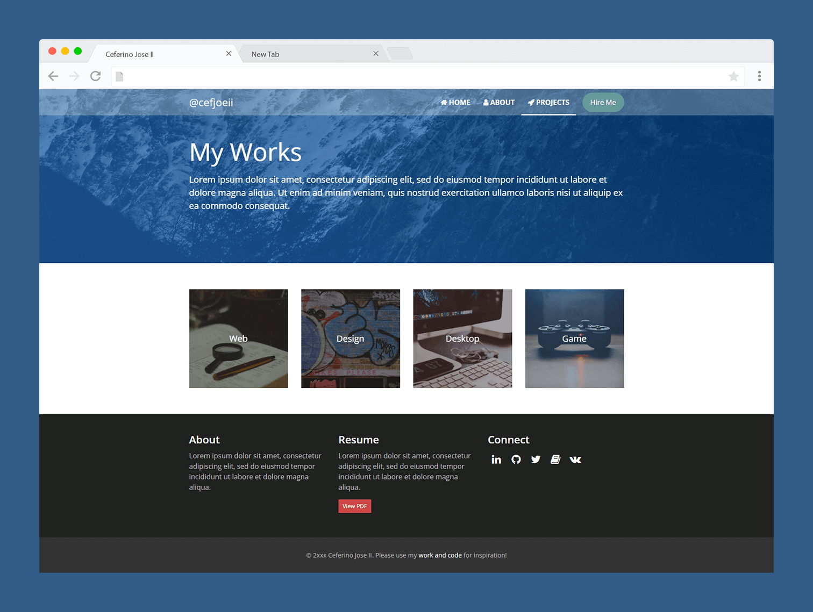

# Welcome to my portfolio website!

URL: [https://cefjoeii.com](https://cefjoeii.com)

 

## Show Some :heart: :wave:

## Technologies

It's written from ground up using [GitHub Pages and Jekyll](https://www.youtube.com/watch?v=2MsN8gpT6jY), a static site generator. It does the processing on the build time instead of runtime. The processed webpage files are directly served to the client instead of routinely processing from the server on the fly. In simple words, it's FASTER! It's hosted for free ($0) here on GitHub.

[Carverous](https://github.com/carverous/carverous), a simple framework that I wrote was used for the layout. For the contact form, I used Formspree's API. The images were compressed to make the pages load quicker. It can be browsed using the keyboard (arrow keys, space, tab, and enter).
